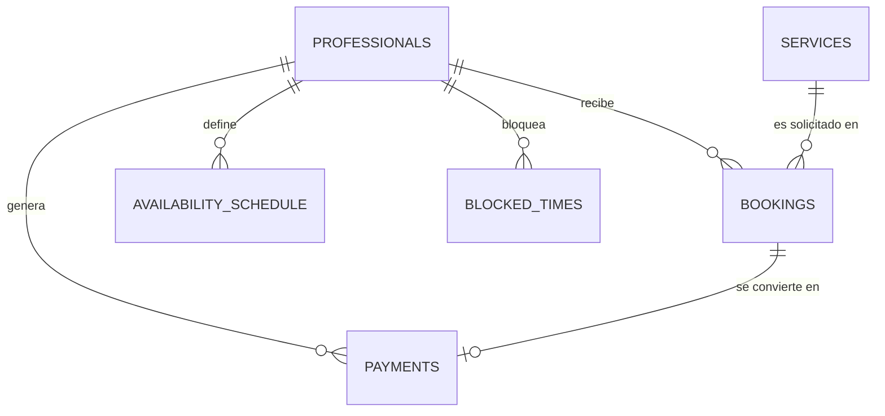

# Modelo de Datos (Data Model)

Este documento describe el esquema de la base de datos relacional (PostgreSQL) para la plataforma de Barbería.

## Entidades Principales

### 1. `professionals`
Representa a los barberos o profesionales del sistema.
- **Campos principales**: `id` (UUID), `name`, `email`, `username`, `password_hash`, `role` (PROFESSIONAL / PROFESSIONAL_ADMIN), `rating`.
- **Relaciones**: Tiene muchas reservas, pagos, horarios de disponibilidad y bloqueos.

### 2. `services`
Servicios que ofrece la barbería.
- **Campos principales**: `id` (UUID), `name`, `price_estimate`, `duration_minutes`.
- **Relaciones**: Asignado opcionalmente a una reserva (`bookings`).

### 3. `bookings`
La reserva hecha por el cliente.
- **Campos principales**: `id`, `professional_id`, `service_id`, `client_name`, `client_email`, `booking_date`, `booking_time`, `status` (PENDING, CONFIRMED, COMPLETED, CANCELLED).
- **Mecanismo de Confirmación**: `confirmation_token`, `token_used`, `token_expires_at`.
- **Relaciones**: Un profesional, un servicio (opcional).

### 4. `payments`
Registro financiero generado cuando una cita se completa.
- **Campos principales**: `id`, `booking_id`, `professional_id`, `amount`, `payment_date`.
- **Relaciones**: Pertenece a una reserva y a un profesional.

### 5. `availability_schedule` y `blocked_times`
- **`availability_schedule`**: Días y horas de trabajo habitual (0-6 día de la semana).
- **`blocked_times`**: Excepciones manuales, fechas y horas específicas en las que el profesional no puede recibir citas.

---

## Diagrama ER Simplificado

